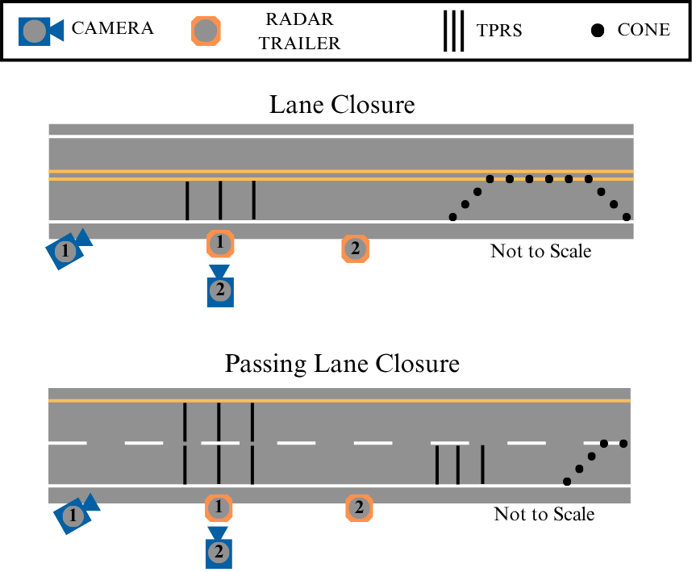
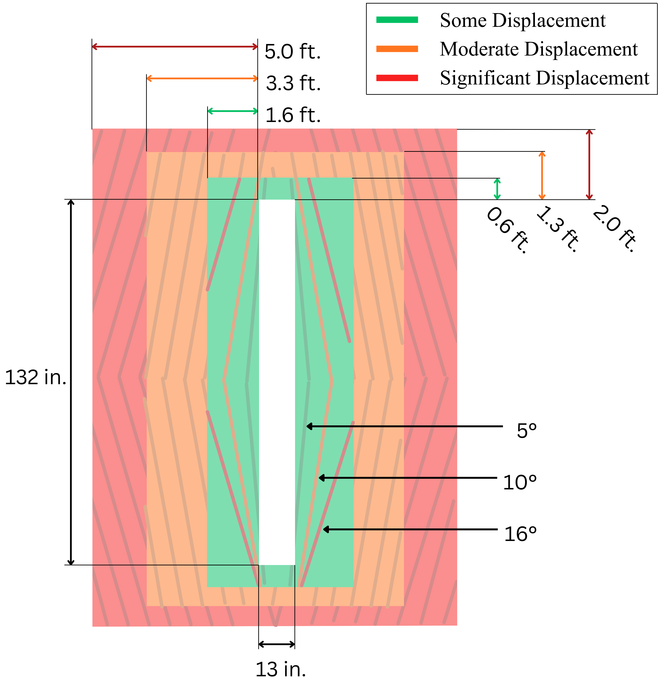
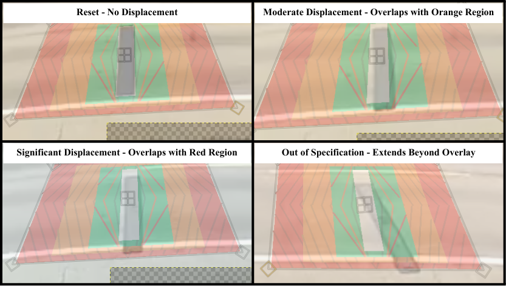

# Methodology {#sec-methodology}

```{r setup, include=FALSE, cache = FALSE}
# a number of commands need to run at the beginning of each chapter. This
# includes loading libraries that I always use, as well as options for 
# displaying numbers and text.
source("R/chapter_start.R")
library(tinytable)
library(targets)
library(tidyverse)
library(ggspatial)
library(sf)
library(prettymapr)
knitr::opts_chunk$set(echo = FALSE, message = FALSE, warning = FALSE)
```


## Site Selection

The research team identified four sites at UDOT work zones in the Summer 2025 construction season compatible with the goals of this research. 
These sites are at the locations shown in @fig-map and data collection dates described in @tbl-sites. 
Site selection criteria included sequencing of researcher travel, planned construction
schedules, variety of site speeds and roadway types, and expected traffic
volume. 
Nearby traffic counting stations provided volume data to confirm that
sufficient samples to conduct statistical analysis were available.

```{r echo=FALSE, message=FALSE, warning=FALSE}
#| label: fig-map
#| fig-cap: Map of Utah with study locations.
#| out-width: 80%
#| 
utah <- tigris::states(progress_bar = FALSE) |> dplyr::filter(STUSPS == "UT")
sites <- sf::read_sf("data/sites.geojson")

site_coordinates <- sf::st_coordinates(sites)
site_callouts <- sites |>
  sf::st_drop_geometry() |>
  transmute(
    site_x = site_coordinates[, "X"],
    site_y = site_coordinates[, "Y"],
    label = paste0("Site ", site, ": ", Roadway),
    label_x = case_when(
      site == 1 ~ -111.65, site == 2 ~ -110.10,
      site == 3 ~ -113.15, site == 4 ~ -111.45
    ),
    label_y = case_when(
      site == 1 ~ 37.45, site == 2 ~ 39.25,
      site == 3 ~ 38.75, site == 4 ~ 40.30
    ),
    arrow_x = case_when(
      site == 1 ~ -111.92, site == 2 ~ -110.27,
      site == 3 ~ -112.88, site == 4 ~ -111.17
    ),
    arrow_y = case_when(
      site == 1 ~ 37.57, site == 2 ~ 39.33,
      site == 3 ~ 38.68, site == 4 ~ 40.19
    )
  )

label_points <- sf::st_as_sf(
  site_callouts,
  coords = c("label_x", "label_y"),
  crs = 4326,
  remove = FALSE
)

arrow_lines <- sf::st_sf(
  label = site_callouts$label,
  geometry = sf::st_sfc(
    lapply(seq_len(nrow(site_callouts)), function(i) {
      sf::st_linestring(matrix(c(
        site_callouts$site_x[i], site_callouts$site_y[i],
        site_callouts$arrow_x[i], site_callouts$arrow_y[i]
      ), ncol = 2, byrow = TRUE))
    }),
    crs = 4326
  )
)

ggplot() + 
  ggspatial::annotation_map_tile(
    "osm", zoom = 7, cachedir = "rosm.cache/utah", progress = "none"
  ) +
  ggspatial::annotation_north_arrow(style = ggspatial::north_arrow_minimal, location = "tr") + 
  ggspatial::annotation_scale(location = "br") +
  geom_sf(data = utah, fill = NA, color = "black") +
  geom_sf(data = sites, color = "#B22222", size = 2.5) +
  geom_sf(
    data = arrow_lines,
    arrow = grid::arrow(
      length = grid::unit(0.12, "inches"), type = "closed"
    ),
    color = "#f1c3c3",
    linewidth = 0.6
  ) +
  geom_sf_label(
    data = label_points,
    aes(label = label),
    color = "#B22222",
    fill = "white",
    size = 3.5,
    linewidth = 0.3
  ) +
  coord_sf(crs = sf::st_crs(3857)) +
  theme(axis.text.x = element_blank(),
        axis.ticks.x = element_blank(),
        axis.text.y = element_blank(),
        axis.ticks.y = element_blank(),
        axis.title = element_blank())

```


```{r}
#| label: tbl-sites
#| tbl-cap: Data Collection Sites
#| 
sites |>
  as_tibble() |>
  select(Site = site, Roadway, Location, Start, End, `Speed Limit`, `Work Zone Limit`, `Closure Type`) |>
  sf::st_drop_geometry() |>
  tt(width = 1)
```

The research team decided on four layouts for the arrays of TPRS to observe the impact of TPRS on driver behavior and strip displacement. The layouts are as follows: 

  - **No TPRS** TPRS are not installed.
  - **UDOT** The current recommended specifications in Region 4, which are 10 ft. for roads with a posted speed limit up to 45 mph, and 20 ft. for roads with a posted speed limit of 50 mph or higher.
  - **1:2** TPRS spaced in feet at half the value of the posted speed limit in miles per hour (e.g. a 60 mph road will have spacing of 30 ft.).
  - **Long** TPRS spaced between five to twenty feet longer than the 1:2 spacing specification.

@fig-diagram illustrates the overall instrumentation plan applied at each site.
The instrumentation plan consists of two video cameras, Camera 1 and Camera 2,
located upstream of the first TPRS array and at the TPRS array, respectively.
There are also two trailer-mounted radar speed detection devices manufactured by
Wavetronix. These are called Wavetronix 1 and Wavetronix 2 and are located at
the first TPRS array and downstream of the first TPRS array, respectively.
Camera 1 and Wavetronix 2 were both installed where space on the shoulder of the
roadway was available. @tbl-wav-spacing provides the actual distance separating
Wavetronix 1 and Wavetronix 2 at each site on each day. Observations at SR-12
were divided into two days, resulting in two different measures.

{#fig-diagram fig-align="center" width="70%"}

```{r eval=FALSE}
#| label: fig-test-spacing
#| fig-cap: "Spacing specifications used in testing."
tar_load(test_spacing_plot)
test_spacing_plot
```

```{r}
#| label: tbl-wav-spacing
#| tbl-cap: "Separation [ft] Between Wavetronix Units"
# INCOMPLETE
tar_load(trailer_spacing)
trailer_spacing |>
  as_tibble() |>
  mutate(Site = 1:4) |>
  select(Site, Roadway = site, UDOT, 'NO TPRS', '1:2', LONG) |>
  tt()
```

The research team placed the quantifiable metrics of this study into two basic categories. The first is driver behavior as observed through change in speed, braking response, and avoidance behavior. The second consists of measured quantities related to TPRS movement, including individual strip displacement and worker exposure during adjustment. The subsections below describe the setup used in this observational study to measure these variables.

## Driver Behavior - Change in Speed, Braking, and Lane Departures
TPRS are designed principally to gain and increase driver attentiveness and not
primarily to reduce speeds; however, measuring driver attentiveness in the general population at an
active worksite presents technical and safety challenges. Change in speed,
braking response, and TPRS avoidance have been used in previous studies as
appropriate proxy measures [@brownEffectivenessTemporaryRumble2022; @fontaineEvaluationSpeedDisplays2001; @sunElevatedRiskWorkZone2011]

Wavetronix units use radar to measure the speed of vehicles within their area of effect based on programmed lane location information adjusted for each site on each day. Accompanying software provides vehicle counts, average speeds, and 85th percentile speed measurements for the vehicles passing the units in bins specified by the user; this study used 15-minute bins. By taking the difference in the 85th percentile speed captured in the same 15-minute bin between Wavetronix 1 and Wavetronix 2, it is possible to measure the change in 85th percentile speed.

Camera 1 was placed roughly 100 ft. upstream from the first TPRS array and provided a view of the rear of vehicles as they encountered the strips. The research team watched the Camera 1 video and marked vehicle classification and relevant behavior using software developed by the research team for this purpose. The researchers recorded when each vehicle crossed the TPRS; classified each vehicle as either a motorcycle, passenger vehicle, or truck; identified whether a vehicle illuminated its brake lights before or after encountering TPRS; and identified whether the vehicle avoided the strips.

The researchers classified each vehicle traversing TPRS. Vehicles with fewer than four wheels were classified as motorcycles. Vehicles with two axles and four wheels were classified as passenger vehicles. Vehicles with more than four wheels or more than two axles (exclusive of trailers) were classified as trucks. This aligns with the FHWA’s 13 vehicle category classification with Class 1 as motorcycles, Classes 2 and 3 as passenger vehicles, and Classes 4 through 13 as trucks [@fhwaOfficeHighwayPolicy2014], and is consistent with the definition of truck used in calculating annual average daily truck traffic [@fhwaTrafficDataPocket2018]. 

The research team classified vehicles as braking before TPRS, after TPRS, or not braking at all. Vehicles driving on the shoulder or crossing the center dividing line ahead of TPRS –- either partially or completely –- were identified as avoiding the TPRS. Vehicles engaged in passing the vehicle in front of them were not considered to be avoiding the strips.

## TPRS Displacement and Worker Exposure
Camera 2 was mounted to the same point as Wavetronix 1 and had a top-down view of the TPRS array, centered on the middle strip of the array. This perspective allowed the team to see how much the center strip of the TPRS array was displaced over time and how much time workers spent adjusting the TPRS.

The research team used a transparent overlay to track TPRS displacement over time. The overlay was based on PSS standards as outlined in their product guide, namely that the strips can move up to 5 ft. forward or back, 2 ft. to either side, and can rotate up to a 3 ft. differential between ends or roughly 15° [@pssBestPracticesOptimal2018]. To provide more nuanced description of displacement, the researchers developed five categories of displacement based on these overall specifications: reset (no movement), some, moderate, significant, and out of specification. @fig-overlay shows the overlay with dimensions for each area marked. The overlay was warped to approximate the perspective of the camera as shown in @fig-examples.


{#fig-overlay fig-align="center" width="60%" fig-pos='t'}

{#fig-examples fig-align="center"}

To quantify and normalize the vehicle impact force to displace a strip, the research team estimated the cumulative momentum --- speed multiplied by mass --- applied to TRPS. The weight of each vehicle was assumed based on the vehicle classification and a mean class weight derived from national data [@volpecenterNationalTransportationStatistics2021]. Each vehicle's speed was assumed to be the mean speed of its 15-minute time bin
as measured by Wavetronix 1.


Camera 2 footage allowed researchers to evaluate worker exposure to traffic when correcting the strip alignment. The research team recorded when workers arrived on site to move TPRS, when vehicles passed while workers were on site, when workers started looking for a gap in traffic, when workers entered the road to adjust TPRS and exited the road, and when the workers left the site. The time when workers were actively engaged in seeking to enter the road was subject to a critical gap analysis [@cite] to identify the length of headway workers will accept for this task.
